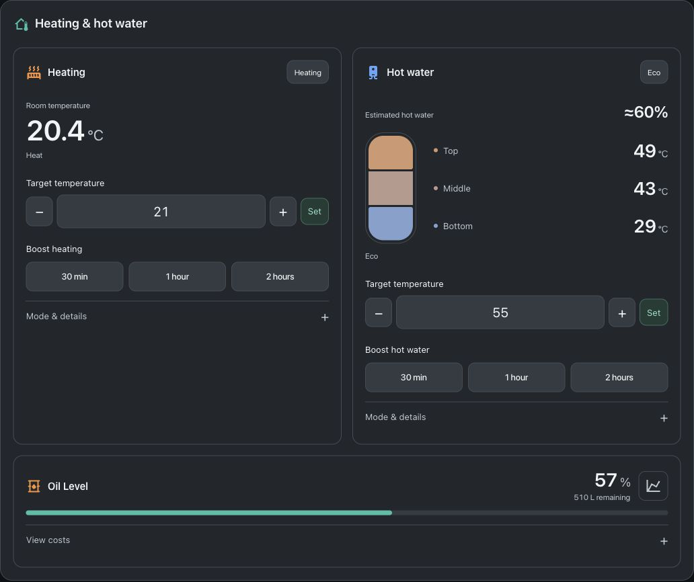
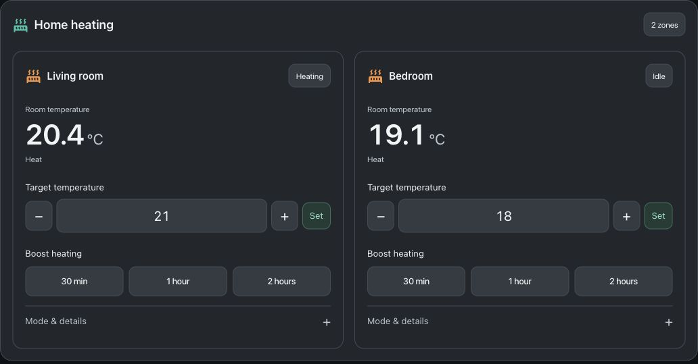
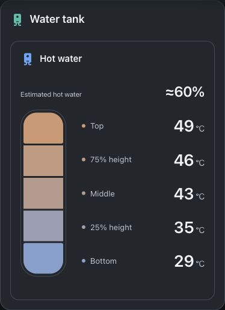
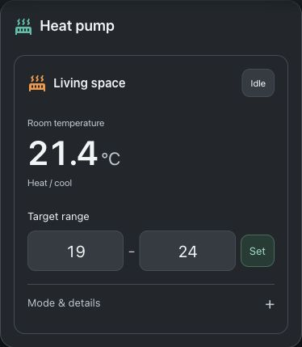
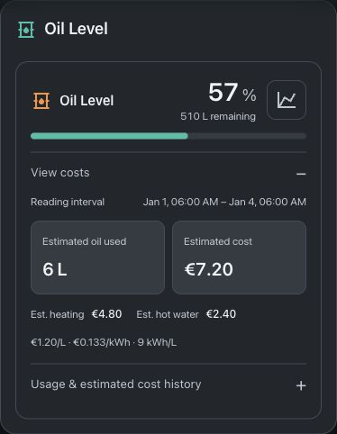

# Slate Heating Card

**v0.1.0** · A composable, mobile-friendly Home Assistant card for heating zones, hot water, tank temperatures and oil levels.

Use one combined card or several focused cards. Configure everything in HA's visual card editor. Standard `climate` entities work across integrations, with controls based on the capabilities each entity exposes. No theme dependency, build step, external fonts, telemetry or runtime dependencies.



## Layouts

Screenshots are captured inside Home Assistant using the Solar Slate theme, native HA icons and the system font. They show sample data; your selected HA theme and device determine the final colours and typography.

**Multiple heating zones / TRVs** — independent temperatures, modes and actions in one card.



**Tank with five probes**, **heat-pump target range**, and **oil only with estimated costs expanded**, at phone width:

<p>
  
  
  
</p>

## Requirements and support

- Home Assistant **2026.9 or newer** is the initial supported baseline for the native visual configuration form. Older frontends have not been validated.
- Heating: one or more `climate` entities, from any integration exposing HA's standard climate capabilities.
- Hot water: a `water_heater`, `climate` or `switch` entity; a tank-only card needs no controller.
- Tank/oil: ordinary HA sensors. There is no dependency on Wiser or Kingspan for these displays.
- Timed boosts and schedules depend on backend support, as explained below. The card cannot create an integration's missing capabilities.

| Entity capability | Card controls |
| --- | --- |
| Climate scalar target | Temperature input and increment/decrement buttons |
| Climate target range | Lower and upper targets, for heat/cool operation |
| Climate HVAC modes / presets | Available modes and presets supplied by the integration |
| Water heater | Supported target temperature and operation modes |
| Hot-water switch | On/off control |
| Wiser climate | Optional native timed boosts and weekly programme editor |
| Other systems | Optional HA boost scripts and a link to a schedule entity |

Controls respect entity temperature limits, steps and HA's temperature unit. Unavailable entities are shown as unavailable. The card reads back state after ordinary controls; a slow device can produce a “not confirmed yet” message rather than a false success.

## Installation

### HACS custom repository

Install from the public [jouwdan/slate-heating-card repository](https://github.com/jouwdan/slate-heating-card) as a HACS custom repository. It is not currently included in the default HACS catalogue.

1. Open **HACS → menu → Custom repositories**.
2. Enter `https://github.com/jouwdan/slate-heating-card` as the repository URL and choose category **Dashboard**, then select **Add**.
3. Find **Slate Heating Card** in HACS and download it.
4. Check **Settings → Dashboards → Resources** for `/hacsfiles/slate-heating-card/slate-heating-card.js`, type **JavaScript module**. Add it if your installation did not do so automatically. Advanced mode may be needed to see Resources.
5. Reload the frontend, edit a dashboard and choose **Add card → Slate Heating Card**.

Do not load both the manual and HACS copies. For YAML-managed resources, add the HACS path to your `lovelace.resources` configuration with `type: module`.

The repository layout follows the [HACS dashboard requirements](https://www.hacs.xyz/docs/publish/plugin/).

### Manual

1. Download [slate-heating-card.js](https://raw.githubusercontent.com/jouwdan/slate-heating-card/main/slate-heating-card.js) and copy it into `/config/www/`. The File editor may show this as `/homeassistant/www/`.
2. Add `/local/slate-heating-card.js?v=0.1.0` in **Settings → Dashboards → Resources**, type **JavaScript module**.
3. Reload the browser or HA companion app frontend and add **Slate Heating Card**.

Only the JavaScript file is needed at runtime. The ZIP is a source/documentation handoff, not an HA integration or add-on.

## Quick start

```yaml
type: custom:slate-heating-card
heating_entities:
  - climate.living_room
  - climate.bedroom
hot_water_entity: water_heater.hot_water
tank_entities:
  - sensor.tank_top_temperature
  - sensor.tank_middle_temperature
  - sensor.tank_bottom_temperature
oil_level_entity: sensor.oil_level
oil_percentage_entity: sensor.oil_percentage
```

Replace these example IDs with your own entities. Sections are inferred when omitted. The default heading follows the displayed sections: an oil-only card says **Oil Level**, a heating-only card says **Heating**, and so on. Set `name` to override it, or leave it blank for an automatic heading.

See [examples/cards.yaml](examples/cards.yaml) for combined, multi-zone, hot-water, tank-only and oil-only configurations.

## Visual editor

Open **Edit dashboard → card menu → Edit**. The native HA form provides:

- Section selection and drag-to-reorder; automatic columns or stacked layout.
- Multiple heating entities and multiple tank probes, both reorderable.
- Header, section titles, schedule, boost and estimate visibility.
- Optional scripts, schedule entity and Wiser hub selection.
- Oil level, price and accounting sensor mappings.

One heating zone uses `heating_name`. Multiple zones use their HA friendly names, so rename the entities in HA if needed. Tank probes must be ordered **top to bottom**.

Automatic layout uses two columns when card width allows and stacks at phone widths. Oil spans the full card width. Choose `stacked` to always use one column. Each card instance has its own configuration and drafts; each zone has an independent unsaved target.

## Configuration reference

All fields are optional except `type`. Entity fields have no household-specific defaults.

| Key | Default | Meaning |
| --- | --- | --- |
| `type` | Required | `custom:slate-heating-card` |
| `name` | Automatic | Header derived from visible sections; blank also selects automatic |
| `sections` | Inferred | Ordered unique list of `heating`, `water`, `oil`; `[]` selects none |
| `layout` | `auto` | `auto` or `stacked` |
| `show_header` | `true` | Main heading and multi-zone badge |
| `heating_entities` | `[]` | Ordered list of unique `climate` entity IDs |
| `heating_name` | `Heating` | Title when there is a single heating zone |
| `hot_water_entity` | None | `climate`, `water_heater` or `switch` entity |
| `water_name` | `Hot water` | Hot-water section title |
| `tank_entities` | `[]` | Temperature sensors, ordered top to bottom; any number |
| `show_tank_estimate` | `true` | Show percentage when at least two valid probes are configured |
| `tank_hot_threshold` | `40` | Reference temperature in °C, from 30 to 60 |
| `show_boost` | `true` | Show timed boosts where supported/configured |
| `boost_script` | None | HA script for timed boost on non-Wiser systems |
| `cancel_boost_script` | None | HA script to cancel/restore a generic boost |
| `show_schedule` | `true` | Show Schedule tab if a backend/adapter is configured |
| `schedule_entity` | None | Opens the native HA dialog for an existing schedule/helper entity |
| `hub` | Auto for one hub | Wiser adapter hub name; required to disambiguate multiple hubs |
| `oil_name` | `Oil Level` | Oil section title |
| `oil_level_entity` | None | Remaining volume sensor, in litres |
| `oil_percentage_entity` | None | Percentage-full sensor |
| `oil_report_entity` | None | Actual latest oil reading timestamp |
| `oil_cost_entity` | None | Estimated cost sensor with ledger attribute; enables View costs |
| `oil_usage_entity` | None | Cumulative estimated litres, for history |
| `oil_heating_cost_entity` | None | Cumulative estimated heating cost, for history |
| `oil_water_cost_entity` | None | Cumulative estimated hot-water cost, for history |
| `oil_price_entity` | None | Price per litre, with matching currency unit |
| `oil_price_kwh_entity` | None | Optional price per kWh fallback |
| `currency` | `EUR` | Three-letter currency code, such as EUR or GBP |
| `energy_per_litre` | `9` | kWh/L used for price fallback; must match your backend |

Standard Lovelace options such as `grid_options` and visibility can be used normally.

## Timed boosts and schedules

### Standard HA systems

The 30-minute, 1-hour and 2-hour buttons appear when `boost_script` is configured. The card calls `script.turn_on` with:

```yaml
entity_id: script.your_timed_boost
variables:
  target_entity: climate.living_room
  duration_minutes: 30
```

The same configured script receives the selected heating zone or hot-water entity. It must handle those entity domains. `cancel_boost_script` receives `target_entity` only.

Your script/backend must own the timer, remember and restore the previous mode/target, and handle repeated boosts, cancellation and HA restarts. No timer runs in the browser. For multiple zones, keep restoration/timer state per entity. A successful script call means **boost requested**, not that the script completed or heat was confirmed. This release supplies the script interface, not a universal boiler-control automation.

HA has no universal weekly schedule editing API. `schedule_entity` opens an existing schedule/helper's native dialog; editing capabilities depend on that entity and HA. This card does not automatically connect a schedule helper to your thermostat. Configure that in an automation or the integration first.

### Optional Wiser adapter

The [Drayton Wiser integration](https://github.com/asantaga/wiserHomeAssistantPlatform) exposes native timed boosts and programme APIs. When those capabilities are detected, the card retains native boosts, override cancellation and a weekly editor. Programmes validate times, temperature steps and daily limits; saving checks for external changes and reads the programme back.

Editing a shared Wiser programme affects every room assigned to it. Select `hub` for multiple hubs. The Wiser programme adapter uses its native Celsius setpoints. These extra capabilities do not restrict generic HA climate controls to Wiser.

## Tank temperatures and estimated hot water

Add as many probes as you have, ordered **top to bottom**. All configured probes are displayed, with a temperature-coloured layer for each. Tap a temperature to open its HA history. Celsius and Fahrenheit sensor readings are supported.

With one probe the card shows temperature only. With at least two valid probes it interpolates the fraction above `tank_hot_threshold`, rounded to 5%. The model assumes evenly spaced probes spanning the full height of a uniform tank. Irregular spacing or a different tank shape reduces accuracy. Missing values and common fault values suppress the estimate.

The percentage is an **estimate of tank volume at or above the reference temperature**. It is not a measurement of usable mixed-water litres, remaining shower time or water hygiene. Without external probes, a compatible hot-water controller's own current temperature is displayed instead.

## Optional estimated oil costs

An oil-level card works with just a volume and/or percentage sensor. Costs remain collapsed under **View costs** and are labelled as estimates.

The card only displays accounting supplied by HA. It does not create sensors, retain history or calculate ongoing usage in the browser. [examples/oil-tracking-package.yaml](examples/oil-tracking-package.yaml) is an optional backend template; replace its input entities before enabling it through HA's [packages configuration](https://www.home-assistant.io/docs/configuration/packages/).

The example expects litre-based level/capacity, actual reading timestamps, EUR prices and 9 kWh/L. Its demand sensors use `On`/`Off`; adapt all history-state matches if your sensors use other values. Configure recorder retention long enough to cover your usual oil-report gaps. Changing the card's currency or kWh/L does not change this backend.

It accumulates level drops across the **whole reporting interval**, including multi-day gaps. Rises of at least 20 L rebaseline as a likely refill; smaller rises do not raise the baseline. Refill-interval usage cannot be measured. Price is captured when each report arrives and retained in estimated cost history. Heating/hot-water allocation uses relative demand-hours across that interval only when sufficient history exists; otherwise costs remain unallocated. This is a demand-time allocation, not separate fuel metering. Sensor variation, boiler cycling and circuit loads affect accuracy.

The `oil_cost_entity` needs a `ledger` attribute shaped as follows:

```json
{
  "since": "2026-01-01T00:00:00Z",
  "reports": 1,
  "litres": 6,
  "cost": 7.2,
  "heating": 4.8,
  "water": 2.4,
  "unallocated": 0,
  "unpriced_litres": 0,
  "last": {
    "start": 1767225600,
    "report": 1767484800,
    "litres": 6,
    "cost": 7.2,
    "heating": 4.8,
    "water": 2.4,
    "refill": false
  }
}
```

`start` and `report` are Unix seconds; `since` is an ISO timestamp. `last.report` must match `oil_report_entity` within two seconds. Unknown costs/allocations are `null`, not zero. All amounts use your configured currency. The supplied package includes additional baseline fields for its own tracking. No Energy dashboard configuration is needed.

## Migration and troubleshooting

- Legacy `custom:wiser-slate-card` remains an alias. Load only one module; switch to `custom:slate-heating-card` when convenient.
- `heating_entity` is accepted as a legacy single-zone mapping. `tank_top_entity`, `tank_middle_entity` and `tank_bottom_entity` are accepted as legacy probe mappings. Explicit arrays take precedence, including empty arrays.
- Old implicit household defaults were removed. Explicitly map every entity you want, including optional oil ledger/price sensors.
- Wrong default title: clear **Card title** to use the section-based heading. An explicitly saved title is respected.
- “Custom element doesn't exist”: check the module resource, avoid duplicate versions and reload the frontend. After manual updates, change the resource version query; refresh the companion app frontend too.
- No boosts/schedule: the entity needs native adapter support or configured scripts/schedule entity. Standard climate mode and temperature controls do not imply a timed-boost API.
- No tank estimate: at least two valid, ordered readings are required, and the estimate must be enabled.
- No estimated cost: select the ledger sensor and correct timestamp/price entities; a raw daily oil-consumption sensor is not the required ledger.

## Development

```sh
npm test
```

Node 22 was used for release checks. Tests use built-in assertions, with no npm dependencies. They cover configuration validation, multi-zone capabilities and routing, schedule conflicts/readback, boost confirmation, N-probe estimates, units and oil accounting display. Browser checks additionally cover independent drafts, focus preservation, range controls and phone layouts. No real heating commands were issued for visual testing.

To run the sample browser checks, serve this folder locally (`python3 -m http.server 8766 --bind 127.0.0.1`) and open `http://127.0.0.1:8766/tests/browser.html`. The harness uses synthetic state and local service stubs; it does not connect to HA.

Keep `slate-heating-card.js` as the directly installable module. See [RELEASING.md](RELEASING.md) for packaging/publication and [CHANGELOG.md](CHANGELOG.md) for version history.

MIT licensed. [Report an issue](https://github.com/jouwdan/slate-heating-card/issues) or [open a pull request](https://github.com/jouwdan/slate-heating-card/pulls). Include the HA version, relevant capability attributes and a minimal anonymised card configuration in bug reports. Remove credentials and household-specific identifiers before sharing diagnostics.
